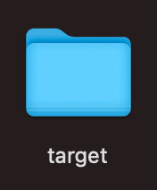
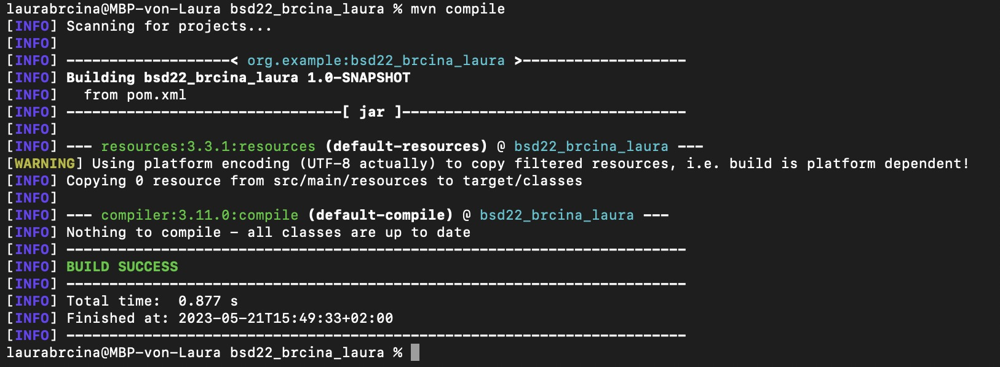

# Exercise 3
## Dokumentation der Arbeitsschritte
+ Umgebungsvariable festgelegt
+ Calculator Klasse und Main Klasse erstellt und im Package gespeichert
+ Nach der ersten Ausführung wurde ein Target Ordner erstellt

## Screenshot vom erfolgreichem Build mittels mvn compile

## Hochladen auf GitHub