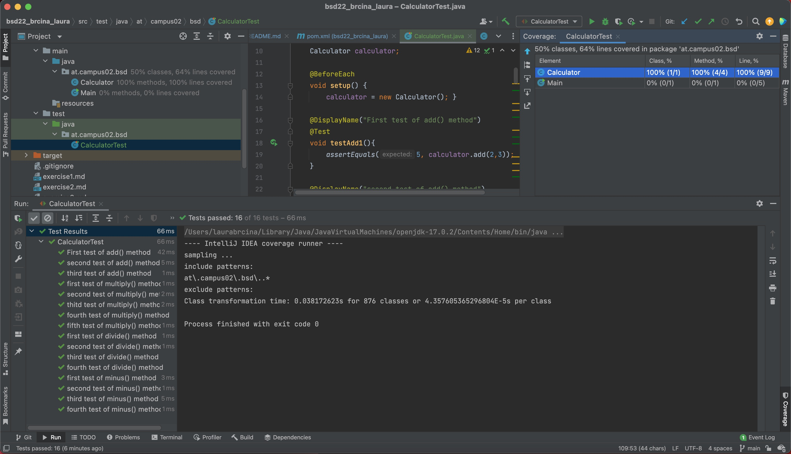
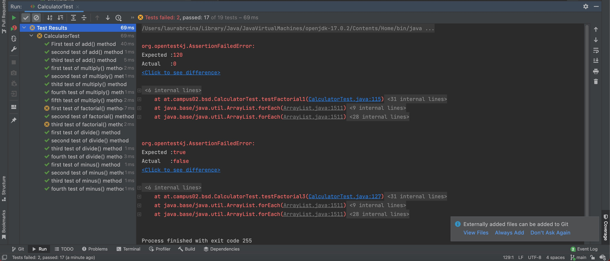

# Testcases
___
### Beschreibung der Testcases
Die Testmethoden habe ich nach folgendem Schema genannt test+"Methodenname"+Nummer der Testmethode.
___
#### Auflistung der Methoden:
+ testAdd1 (assertEquals(5,add(2,3)))
+ testAdd2 (assertTrue(3 == add(1,2)))
+ testAdd3 (assertFalse(2 == add(10,2))
+ testMinus1 (assertEquals(10,minus(20,10)))
+ testMinus2 (assertTrue(6 == minus(12,6)))
+ testMinus3 (assertTrue(-10 == minus(-20,-10)))
+ testMinus4 (assertFalse(5 == minus(10,2)))
+ testDivide1 (assertEquals(10, divide(20,2)))
+ testDivide2 (assertTrue(12 == divide(12,1)))
+ testDivide3 (assertFalse(0 == divide(2,0)))
+ testDivide4 (assertFalse(15 == divide(10,2)))
+ testMultiply1 (assertEquals(6, multiply(2,3)))
+ testMultiply2 (assertTrue(10 == multiply(10,1)))
+ testMultiply3 (assertTrue(0 == multiply(5,0)))
+ testMultiply4 (assertTrue(0 == multiply(0,0)))
+ testMultiply5 (assertFalse(20 == multiply(5,10)))

___
### Aufgabenteil 2:
#### Methode zur Berechnung der Fakultät
+ testFactorial1(assertEquals(120, factorial(5)))
+ testFactorial2(assertTrue(0 == factorial(-2)))
+ testFactorial3(assertTrue(1 == factorial(0)))

Zusätzlich habe ich die Methode public int factorial(int number) in Calculator.java implementiert.
Die Fakultät ist nur auf die Natürliche Zahlen definiert, weshalb int als Datentyp gewählt wurde.

