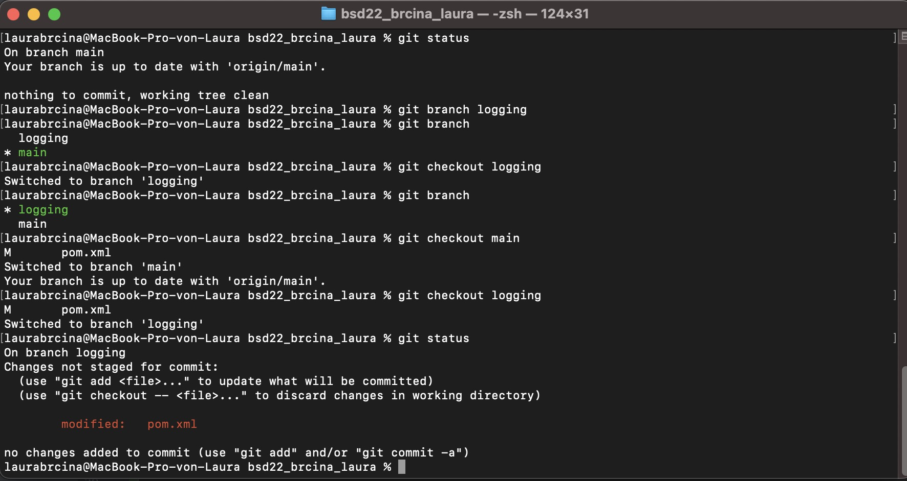
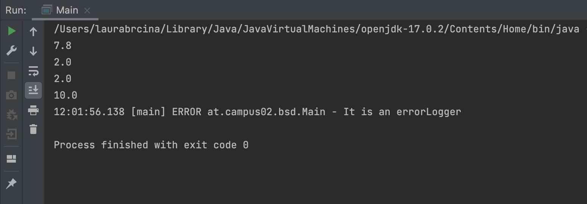
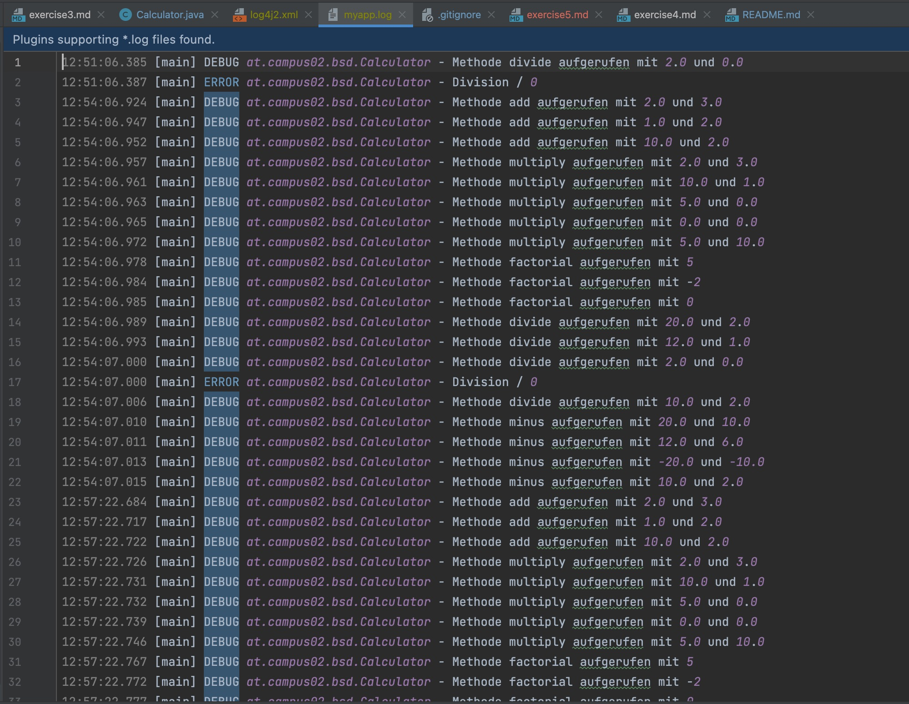
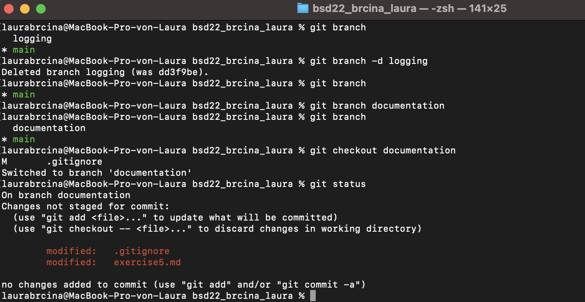

# Exercise 5

Branch wurde erstellt und gewechselt.

Aufgabe: Erweitern Sie Ihre main Methode (falls noch nicht existiert) und initialisieren Sie in dieser Klasse ein Logging Objekt. Setzten Sie an einer beliebigen Stelle zwei Log Einträge ab, wobei der Textinhalt irrelevant ist, jedoch das Level Info und Error genutzt werden sollen. 

* Was fällt Ihnen dabei auf?

Die Meldung mit dem Level Info wird nicht in der Konsole ausgegeben.

* Template

Es existiert ein Template für die Konfiguratonsdatei der log4j2 api. Diese heißt [log4j2.xml.template](/Users/laurabrcina/bsd22_brcina_laura/src/main/resources/log4j2.xml.template)
und beschreibt, dass die logs in der Datei logs/myapp.log gespeichert werden sollen.

Inhalt der log-Datei:

___ 

* Warum werden Logging Bibliotheken verwendet?

Eine Protokollierungsbibliothek (oder Protokollierungsframework) ist Code, den Sie in Ihre Anwendung einbetten, um Protokollereignisse zu erstellen und zu verwalten. Protokollierungsbibliotheken stellen APIs zum konsistenten Erstellen, Strukturieren, Formatieren und Übertragen von Protokollereignissen bereit. Wie Agenten werden sie verwendet, um Ereignisse von Ihrer Anwendung an ein Ziel zu senden. Der Unterschied besteht darin, dass Bibliotheken im Gegensatz zu Agenten mit Ihrer Anwendung und nicht getrennt davon ausgeführt werden.

Die Protokollierung ist wichtig, um das Verhalten der Anwendung zu verstehen, unerwartete Probleme zu beheben oder einfach Ereignisse zu verfolgen.

System.out.print() funktioniert während der Codierungsphase gut, aber wenn eine Anwendung in einer Produktionsumgebung live ist, ist eine ordnungsgemäße Nachverfolgung und Überwachung erforderlich.
___

* Welche Loglevel gibt es in Log4J und was hat es damit auf sich?

ALLE – Alle Levels, einschließlich benutzerdefinierter Levels

DEBUG – Bezeichnet Informationsereignisse, die zum Debuggen einer Anwendung am nützlichsten sind.

INFO – Bezeichnet Informationsmeldungen, die den Fortschritt der Anwendung hervorheben.

WARNUNG – Bezeichnet potenziell schädliche Situationen.

FEHLER – Bezeichnet Fehlerereignisse, die es der Anwendung möglicherweise trotzdem ermöglichen, weiterhin ausgeführt zu werden.

FATAL – Bezeichnet sehr schwerwiegende Fehlerereignisse, die vermutlich zum Abbruch der Anwendung führen.

AUS – Der höchstmögliche Rang und soll die Protokollierung deaktivieren.

TRACE – Bezeichnet detailliertere Informationsereignisse als DEBUG.
___

* Was für Konfigurationsmöglichkeiten bietet Ihnen log4J?

Log4j verfügt über die Möglichkeit, sich während der Initialisierung automatisch selbst zu konfigurieren.

Es gibt drei Arten, Log4j zu konfigurieren: mittels einer Properties- oder einer XML-Datei oder im Programmcode.

Die Konfigurationsdateien könen manuell gechrieben werden und dort das Format der logs festgelegt werden, sowie die Ausgabe in eine Datei.
___

Screenshot gitstatus:

