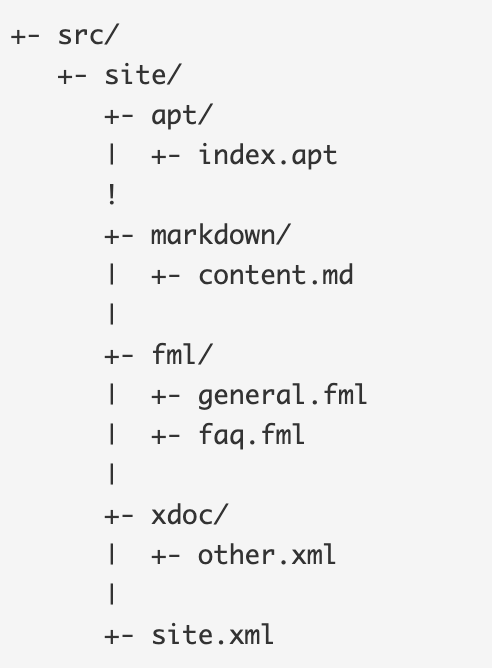

#### Was ist notwendig um Maven Site Dokumentaton zu generieren?
Man benötigt eine notwendige Ordnerstruktur – siehe Abbildung:

Generiert wird die Dokumenation mit dem Befehl mvn site.

#### Welche unterschiedlichen Aspekte, Konfigurationen, Informationen, usw. werden in site.xml bzw. pom.xml konfiguriert? 

Ein Project Object Model oder POM ist die grundlegende Arbeitseinheit in Maven. Es handelt sich um eine XML-Datei, die Informationen über das Projekt und Konfigurationsdetails enthält, die Maven zum Erstellen des Projekts verwendet. Es enthält Standardwerte für die meisten Projekte. Beispiele hierfür sind das Build-Verzeichnis, das im Ordner Target ist; das source directory, das src/main/java ist; das test source directory, das src/test/java ist; usw. 

Beim Ausführen einer Aufgabe oder eines Ziels sucht Maven im aktuellen Verzeichnis nach der POM. Es liest die POM, ruft die erforderlichen Konfigurationsinformationen ab und führt dann Target aus.

Einige der Konfigurationen, die in der POM angegeben werden können, sind die Projektabhängigkeiten, die Plugins oder Targets, die ausgeführt werden können, die Build-Profile usw. 

Weitere Informationen wie Projektversion, Beschreibung, Entwickler, Mailinglisten usw. können ebenfalls angegeben werden.
___
Man kann eigenen site descriptor für eigenes Projekt erstellen, wenn man die Navigationsstruktur für die Site überschreiben möchte. 
Beispielsweise möchte man zusätzliche Inhalte zu der Website hinzufügen. Damit man auf die neuen Inhalte zugreiffen kann, muss man den Site-Deskriptor konfigurieren. 
Der Site-Deskriptor namens site.xml sollte sich im Verzwichnis src/site befinden.

